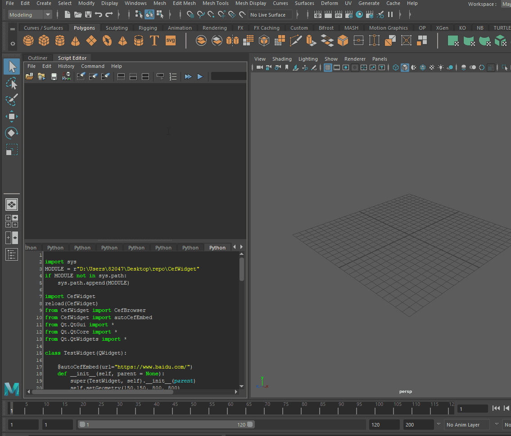
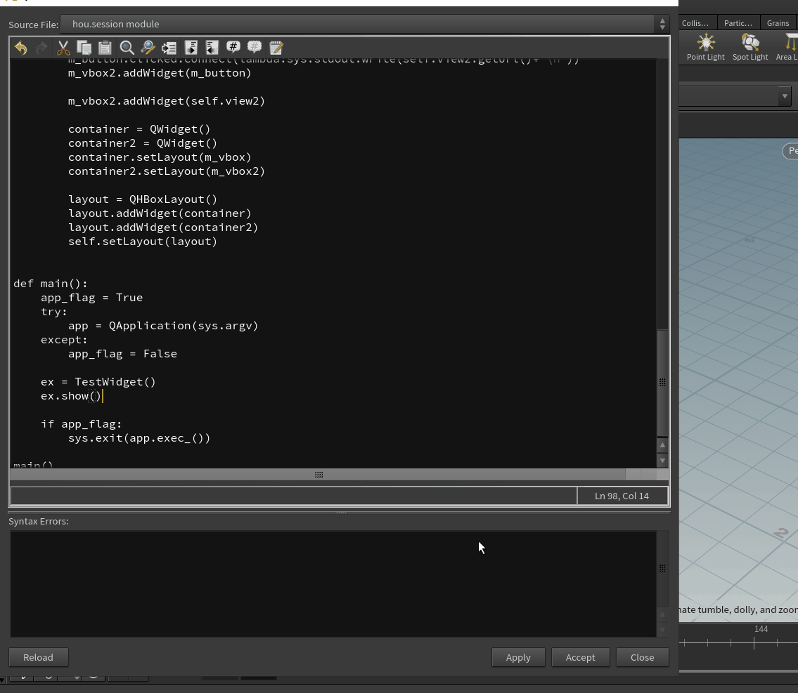
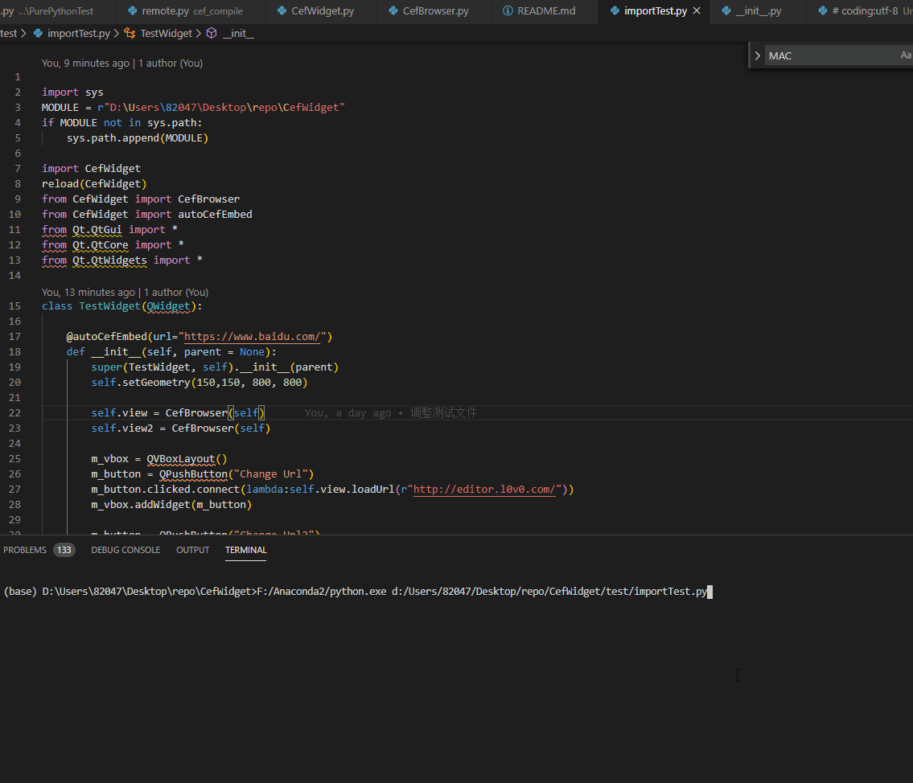

# CefWidget
CefPython Embed to the python Qt Framework software

[中文说明](https://blog.l0v0.com/posts/d2b44b01.html)








# Usage

> Cef is Chromium Embed Framework, And I want to use it for multiplatform WebGL displaying.
> Especially for DCC like Maya Houdini. 

# RefPython pyinstaller

> Using pyinstaller to generate a cefpython3 exe file

> First, you need to install all the dependencies , you can use the pip run the requiremnets.txt in top of the repo.
> Finnally cd to the `cef_compile` directory and run the pyinstaller.py will automatically generate the exe version for you.

```bash
pip install -r requirements.txt
cd cef_compile
python pyinstaller.py
```

> This is compile example modify from the [cefpython3 example](https://github.com/cztomczak/cefpython/blob/master/examples/pyinstaller/README-pyinstaller.md)
> I fix a little Bug in the hook-cefpython3.py (add "." on the 133 line)

# Run CefWidget

> And I got to commit that Cef is really large so I upload the exe version on the release page.
> Please download the refapp.rar file and unzip to the CefWidget folder.
> Then you can use python code `from CefWidget import CefBrowser` to use the CefBrowser.
> It already wrapped by the QWidget and communicate the Cef using socket. 

# Notice

> Don't forget that `embed` function need to run after all the UI layout have been set. otherwise it would error.
> And I add a decorator `autoCefEmbed` which can recusive find all the CefBrowser and call embed method, you can add the decorator to your main window launch method. 
> By default, the socket run on the 4789 Port, you can modify it 


# downside

> Cef Framework is very large and it doesn't support lots of the video format like h.264 by default (because of the license problems)

> there is another C++ Chromium base Framework which is [miniblink](https://github.com/weolar/miniblink49)
> miniblink is much smaller and even embeded node.js to run the electron app.
> If I have more time to do some research,I hope I can find a way to compile it and use it like cef for DCC. 